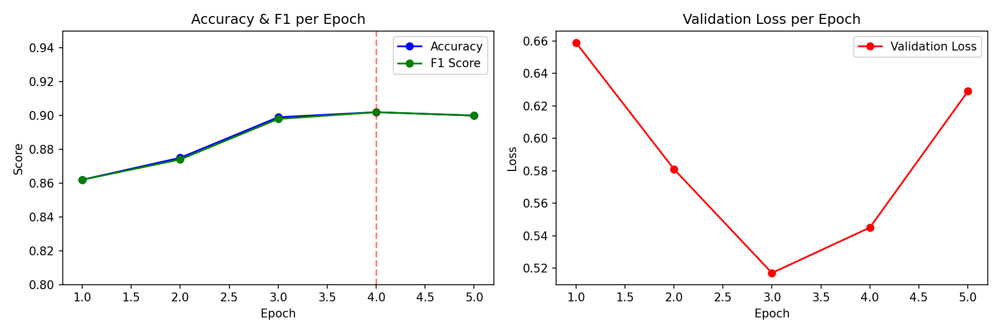

# DistilBERT Sentiment Fine-tuning — IMDB Dataset

Fine-tuned DistilBERT on the IMDB movie reviews dataset for binary sentiment classification (positive/negative). Built as part of my ML learning journey while applying for Amazon ML Summer School 2025.

## Results

| Epoch | Validation Loss | Accuracy | F1 Score |
|-------|----------------|----------|----------|
| 1     | 0.659          | 86.2%    | 0.862    |
| 2     | 0.581          | 87.5%    | 0.874    |
| 3     | 0.517          | 89.9%    | 0.898    |
| 4     | 0.545          | **90.2%**| **0.902**|
| 5     | 0.629          | 90.0%    | 0.900    |

**Best model: Epoch 4 — 90.2% Accuracy, F1: 0.902**

## Model & Dataset

- **Model:** `distilbert-base-uncased` (HuggingFace Transformers)
- **Dataset:** IMDB Movie Reviews (stanfordnlp/imdb)
- **Train samples:** 8,000
- **Test samples:** 2,000
- **Task:** Binary Sentiment Classification (Positive / Negative)

## Training Details

| Parameter | Value |
|-----------|-------|
| Epochs | 5 |
| Batch size (train) | 32 |
| Batch size (eval) | 64 |
| Learning rate | 2e-5 |
| Warmup steps | 200 |
| Weight decay | 0.01 |
| Max token length | 256 |
| Hardware | Kaggle GPU T4 x2 |

## Tech Stack

- Python, PyTorch
- HuggingFace Transformers & Datasets
- scikit-learn (metrics)
- Matplotlib (visualizations)
- Kaggle GPU T4 x2

## Key Learnings

- Fine-tuning a pretrained transformer on domain-specific data significantly outperforms off-the-shelf inference
- Proper train/val/test splits and early stopping (best model at epoch 4) prevent overfitting
- Validation loss increasing after epoch 3 while accuracy stays high indicates slight overfitting — stopped at best checkpoint

## Live Notebook

View on Kaggle → [DistilBERT Sentiment Fine-tuning — IMDB Dataset](https://www.kaggle.com/code/darshnashingavi/distilbert-sentiment-fine-tuning-imdb-dataset)
